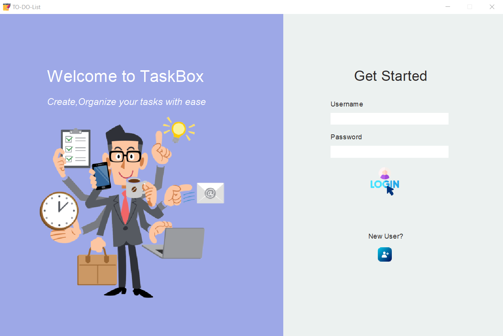
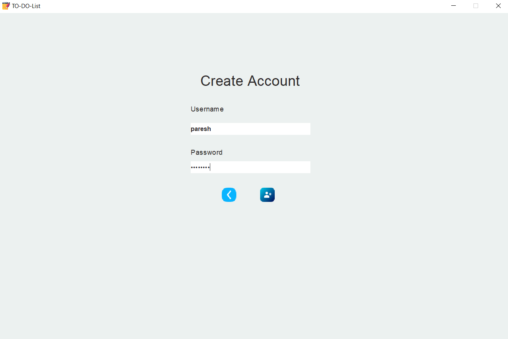
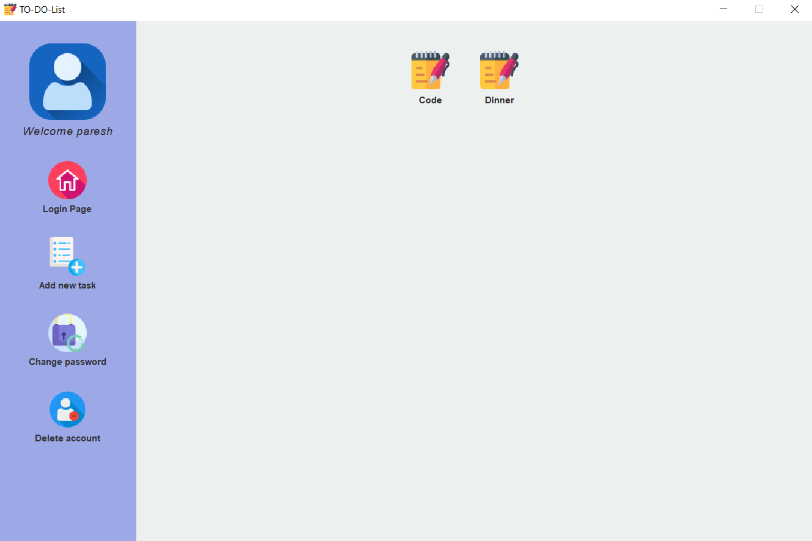

# To-do list app in Java with Hibernate

A To-Do List app using java. User can create account, login, add tasks, change or delete tasks, change password and delete account. It connects to app database (MySQL) using hibernate.Hibernate is a Java framework that simplifies the development of Java application to interact with the database. It is an open source, lightweight, ORM (Object Relational Mapping) tool. Hibernate implements the specifications of JPA (Java Persistence API) for data persistence. I have used maven in this poject. Maven is a powerful project management tool that is based on POM (project object model). It is used for projects build, dependency etc.

## Required Packages
* JDK
* MySQL
* Maven

## IDE Used
* Eclipse

## How to run

### Ubuntu

```
* Install mysql-server : sudo apt-get install mysql-server
* git clone this project
* Open your IDE and import the project.
* Make sure IDE recognizes the project as a Maven project and downloads the necessary dependencies.
* Locate the main class of the project.
* Right-click on the main class and select "Run" or "Run As" > "Java Application" (options may vary depending on IDE).
* The project will now run.
```

* You dont need to create any database or tables as database and tables will created by app. But if you want to create initial user_info tables to fill some values follow this steps:

```
* Start mysql : sudo mysql -u root -p ( password - root)
* To create database : CREATE DATABASE to_do_list_app;
* Connect to database : connect to_do_list_app;
* Create user_info table : CREATE TABLE user_info( user_id varchar(20), user_password varchar(20), PRIMARY KEY (user_id));
* Now that table is created, you can fill some values which you want initially using mySQL commands.Same can also be done by using GUI.
```

## Images

* Login page



* Register



* View and add Task


